# Парсер для Единой информационной системы

### Содержание

1. [Описание проекта](#описание-проекта)
2. [Инструкция по запуску](#инструкция-по-запуску)
3. [Примеры работы](#примеры)
4. [Структура репозитория](#структура-репозитория)
5. [Пайплайн](#пайплайн)

### Описание проекта
В начале второго семестра ввиду введения в нашу образоваетльную программу Проектного практикума, наша команды встала перед сложным и судьбоносным выбором проекта. 
Проведя мозговой штурм внутри команды мы остановились на интересном, на наш взгляд, проекте - 
«Neuromus Tender Intelligence: мониторинг ЕИС, отбор релевантных закупок и прогноз оптимального снижения».
Тогда мы еще не подозревали, к чему нас это приведет, но об этом позже.
Сразу обозначим **цель** нашего проекта:
>Создать на платформе Нейромус ИИ-решение для тендерного отдела, которое ежедневно:
>- Находит и отбирает закупки на ЕИС, точно соответствующие направлениям деятельности компании и заданным фильтрам (заказчик/регион/виды работ), формируя готовую выборку тендеров для проработки сотрудником.
>- Автоматически формирует аналитику по выигранным/проигранным закупкам на основе открытых данных (ЕИС + ФНС + площадки), включающих список потенциальных участников и их возможные взаимосвязи.
>- Для выбранной закупки строит прогноз вероятного снижения цены конкурентами и предлагает вариативность нашего снижения с учётом статистики конкурентов и опыта компании.

Вам, конечно, стало интересно, что такое Neuromus. Ваше любопытство похвально, однако я и сам не знаю, но это сейчас не так важно. Сосредоточимся на цели.

Одной из задач, которые стояли на пути к достижению нашей цели проекта, была задача автоматизированного сбора данных с [Единой Информационнай системы в сфере закупок](https://zakupki.gov.ru/epz/main/public/home.html) (далее ЕИС).
Ввиду отсутствия подходящего нам и в то же время бесплатного API, пришлось оперативно решать вопрос об автоматизации сбора данных. 

К счастью, у меня уже имелся опыт в написании автоматизированных скриптов для парсинга.
Ранее я, конечно, писал парсеры, но они подходили только для отложенного сбора данных, ввиду своей медленной работы, т.к. использовался Selenium с UndetectedWebdriver для обхода ограничений.
Поэтому встала задача найти концептуально новый подход, который бы позволил парсить огромные кластеры данных в разумные сроки.

И эта задача, как вы понимаете, была решена: **[Scrapling](https://github.com/D4Vinci/Scrapling)**.
Новая и свежая библиотека позволила выстроить весьма простой и эффективный пайплайн, благодаря асинхронным веб-скраперам.
Ну а код решения вы и сами можете увидеть в данном репозитории.

### Инструкция по запуску
1. Клонируем репозиторий себе на рабочую лошадку:
```
git clone https://gitverse.ru/Vprs/eis_parser.git
```
2. Создаем и активируем для него виртуальное окружение удобным способом, например:
```
python -m venv venv
source .venv/Scripts/activate
```
3. Устанавливаем все необходимые зависимости:
```
pip install -r requirements.txt
```
4. Запускаем парсер через командную строку:
```
python main.py <start_page> <end_page> <per_page> <pub_date> [--close-date <close_date>]
```

**Аргументы:**
| Аргумент | Тип | Описание |
|----------|-----|----------|
| `start_page` | int | Начальная страница пагинации |
| `end_page` | int | Конечная страница пагинации |
| `per_page` | int | Количество записей на странице |
| `pub_date` | str | Дата публикации в формате ДД.ММ.ГГГГ |
| `--close-date` | str | Дата закрытия в формате ДД.ММ.ГГГГ (опционально) |

**Примеры:**
```bash
# Базовый запуск
python main.py 1 100 10 "24.04.2024"

# С указанием даты закрытия
python main.py 1 100 10 "24.04.2024" --close-date "04.04.2026"

# Справка
python main.py --help
```

> **Важно:** Количество тендеров, согласно ограничению, не должно превышать 1 тысячи.
> Т.е `(end_page - start_page) * per_page <= 1000`

5. Собранные данные будут размещены в формате JSON в директории `art/tenders.json`

### Структура репозитория
```
eis_parser/
├── art/          # Директория для артефактов: храним ссылки и итоговый результат
├── cfg/          # Валидатор параметров, селекторы и вспомогательный класс получения ссылок
├── other/        # Вспомогательные функции отчистки текста
├──spiders/       # Асинхронные пауки
├──.gitignore
├──requirements.txt
├──main.py        # Основной скрипт, запускающий процесс (CLI)
└── README.md     # Вы его читаете
```
### Пайплайн

```mermaid
flowchart TD
    A["main.py: запуск main()"] --> B["parse_args()\nЧтение аргументов CLI"]
    B --> C["validate_params()\nВалидация параметров"]
    C --> D["LinkSpider.start()\nstart_page, end_page, per_page, pub_date, close_date"]
    D --> E["LinksCollector.collect_pagination()"]
    E --> F["Генерация URL страниц\nzakupki.gov.ru/.../results.html?page=1..100"]
    F --> G["Асинхронный обход страниц\nLinkSpider.parse()"]
    G --> H["Парсинг блоков div.row\n(BLOCK_TENDER)"]
    H --> I["Извлечение ссылок\nиз div.registry-entry__header-mid__number"]
    I --> J["Сохранение в art/links.json"]

    J --> K["TenderSpider.start()\nstart_page, end_page, per_page, pub_date, close_date"]
    K --> L["LinksCollector.collect_tenders_links()\nЧтение art/links.json"]
    L --> M["Формирование полных URL\nhttps://zakupki.gov.ru + link"]
    M --> N["Асинхронный обход тендеров\nTenderSpider.parse()"]
    N --> O["Парсинг всех section\nна странице тендера"]
    O --> P{"Есть span.section__title?"}
    P -->|Да| Q["simple_clean() — очистка заголовка"]
    P -->|Нет| R["unnamed1, unnamed2..."]
    Q --> S{"Есть span.section__info?"}
    R --> S
    S -->|Да| T["simple_clean() — очистка содержимого"]
    S -->|Нет| U["Пропуск секции"]
    T --> V["Сборка data{title: info}"]
    U --> V
    V --> W["Сохранение в art/tenders.json"]

    classDef start fill:#1a1a2e,color:#eaeaea,stroke:#0f3460,stroke-width:2px
    classDef process fill:#16213e,color:#eaeaea,stroke:#0f3460,stroke-width:2px
    classDef decision fill:#1a1a2e,color:#eaeaea,stroke:#e94560,stroke-width:2px
    classDef data fill:#0f3460,color:#eaeaea,stroke:#533483,stroke-width:2px

    class A,B,G,K,N start
    class C,F,I,L,M,O,Q,T,V process
    class D,E,J,P,R,S,U decision
    class W data
```

